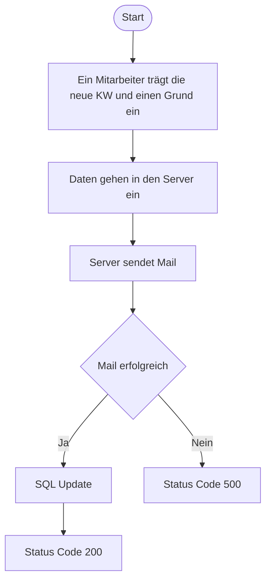
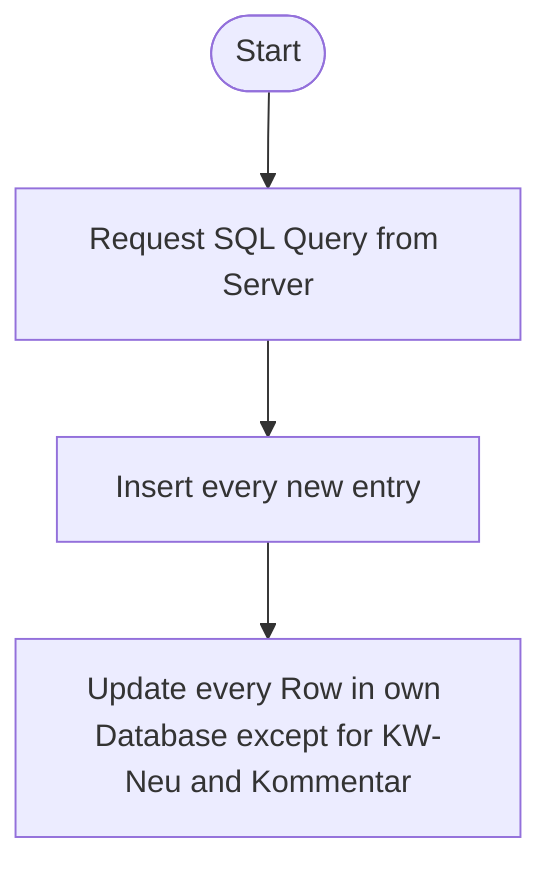

# Lieferverzug Kanban

Dies ist eine Rehatec Kanban Website, die eine Erweiterung für die bestehende Website ist. 

## Basic Funktion

Wenn sich ein Lieferauftrag verspätet, dann trägt man in dieser Website ein, was die neue Kalendarwoche ist + einen Grund, der intern gespeichert wird. Wenn dass dann abgeschickt wird erstellt der Server automatisch eine Mail und schickt diese zum Client.

### Eine Verspätung wird festgestellt

### Die Kanban Datenbank aktualisiert sich (6:00 Uhr, 9:00 Uhr, 12:00 Uhr, 15:00 Uhr)


## SQL Structure:
|Columnname|Datatype|NULL|
|---|---|---|
|ID|?|NO|
|Jahr|INT|NO|
|KW|INT|NO|
|KW-Neu|INT|YES|
|Kommentar|TEXT|YES|
|Kunde|TEXT|NO|
|Auftrag|TEXT|NO|
|Kommission|TEXT|NO|


## SQL Querys
### Mirror Database Kanban
```
SELECT Jahr, KW, KW-Neu, Kommentar, Kunde, Auftrag, Kommission
FROM 

```

### Get Data for Website
```
SELECT 
```


## Aufbau der Website

|Auswählen|Jahr|KW|KW neu|Kommentar|Kunde|Auftrag|Kommission|Lieferverzug|Verzugsgrund|Abschick Button|
|---|---|---|---|---|---|---|---|---|---|---|
|[ ]|2026|KW27|KW29|Mitarbeitermangel|AGIL|AU-202607-204393 (Vorgangsnummer)|Meierkord#100807 - Schule / SB(Vorgangstext)|numberfield|textfield|button|
|[ ]|2026|KW27|-||Brendale|AU-202607-375932 (Vorgangsnummer)|DEMO Benni(Vorgangstext)|numberfield|textfield|button|

Kalendarwoche farblich markieren:
- Vergangenheit: Rot
- Aktuell: Gelb
- Zukunft: Grün

## Beispiel env

```
# Database access
HOST = "192.168.178.1"
USERNAME = "admin"
PASSWORD = "password"
DATABASE = "lieferungen"

# SMTP acess
CLASS_NAME = "Smtp"
HOST = "mail.example.com"
PORT = 587
TIMEOUT = 30
FROM = "lieferverzug@example.com"
CLIENT = "None"
TLS = "True"

```

